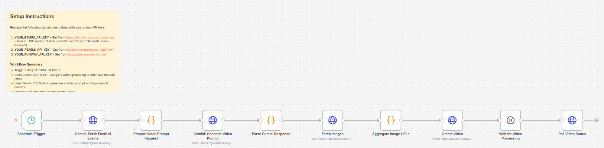

# Daily Football Video Generation — Gemini

Automated n8n workflow that generates a daily football highlights video using **Google Gemini** as the AI backbone.

## How It Works

1. **Schedule Trigger** — Runs daily at 12:00 PM
2. **Fetch Football News** — Gemini 2.0 Flash with Google Search grounding pulls the latest football events
3. **Generate Video Prompt** — Gemini crafts a cinematic video prompt and image search queries
4. **Fetch Images** — Pexels API retrieves relevant football imagery
5. **Create Video** — Runway ML generates an image-to-video clip
6. **Poll for Completion** — Waits ~60s then checks Runway for the finished video

## APIs Used

| Service | Purpose |
|---------|---------|
| Google Gemini | News fetching + prompt generation |
| Pexels | Stock image retrieval |
| Runway ML | Video generation |

## Workflow Screenshot

