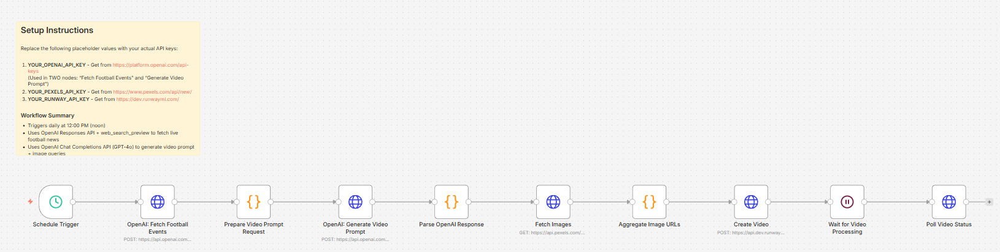

# Daily Football Video Generation — OpenAI

Automated n8n workflow that generates a daily football highlights video using **OpenAI** for both news discovery and content generation.

## How It Works

1. **Schedule Trigger** — Runs daily at 12:00 PM
2. **Fetch Football News** — OpenAI Responses API with `web_search_preview` finds the latest football events
3. **Generate Video Prompt** — OpenAI GPT-4o Chat Completions crafts a cinematic video prompt and image search queries
4. **Fetch Images** — Pexels API retrieves relevant football imagery
5. **Create Video** — Runway ML generates an image-to-video clip
6. **Poll for Completion** — Waits ~60s then checks Runway for the finished video

## APIs Used

| Service                 | Purpose                      |
| ----------------------- | ---------------------------- |
| OpenAI Responses API    | News fetching via web search |
| OpenAI Chat Completions | Prompt generation            |
| Pexels                  | Stock image retrieval        |
| Runway ML               | Video generation             |

## Workflow Screenshot

